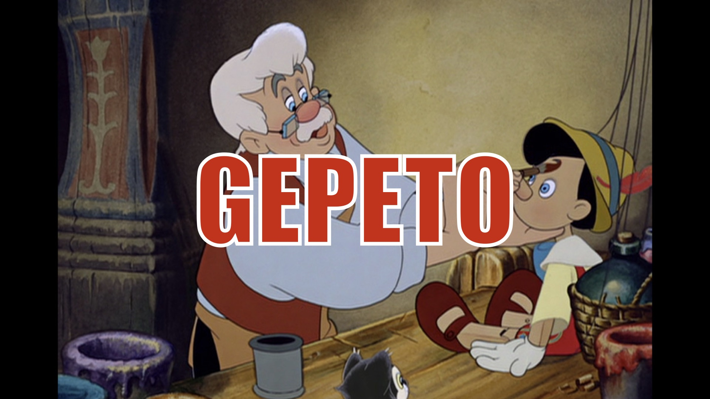

# gepeto

Generate 1-Click AI Launchers, Instantly.

---



---

# community

Gepeto is new and evolving, so please join the community to stay on top and ask questions:

1. Discord: https://discord.gg/TQdNwadtE4
2. X (Twitter): https://x.com/cocktailpeanut

---

# usage

#### 1. Get Pinokio

Gepeto generates Pinokio scripts, so you will need Pinokio to test them.

Download Pinokio here: https://program.pinokio.computer/#/?id=install

#### 2. Run

To make sure the generated scripts show up on your Pinokio app, first go to your `/PINOKIO_HOME/api` folder. Then run:

```
npx gepeto@latest
```

This will ask some questions and create a new project folder for you under the `/PINOKIO_HOME/api` folder.

> Learn more about Pinokio File System here: https://program.pinokio.computer/#/?id=home-directory

---

# how does it work?

Gepeto is a script that generates [Pinokio scripts](https://program.pinokio.computer) automatically.

By default it assumes that there's:

1. A `requirements.txt` file for installation
2. An `app.py` file for running the app

It's the same convention used by [huggingface spaces](https://huggingface.co/spaces), which means any huggingface space app can be easily ported (with some code modifications to localize)

---

# customizable

By default Gepeto generates some scripts that follow the convention, but you can very easily modify the generated scripts yourself since they are very short.

> To learn how to customize the scripts, check out the Pinokio Programming Manual: https://program.pinokio.computer

---

